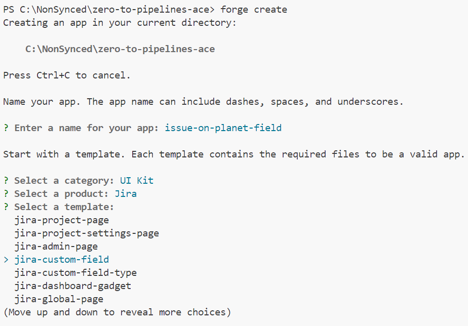

# zero-to-pipelines-ace
 Demos from the Zero to Pipelines Atlassian Community Event

 The below steps walk you through creating the ***issue-on-planet-field*** app which connects to the Star Wars API and gives your users a list of planets to pick from on their Jira issues.  This could easily be used to pull a list of company specific items to add to your issues.

## Prerequisites
1. Latest version of the [Forge CLI](https://developer.atlassian.com/platform/forge/cli-reference/) 
2. A valid [API Token](https://id.atlassian.com/manage-profile/security/api-tokens) from Atlassian
3. Logged in terminal session with `forge login`

## Step One
Run `forge create` to create a new **UI Kit** app for **Jira** with the `jira-custom-field` type.

This will get us our base scaffolding for the application as well as get things configured for a **UI Kit** or **Custom UI** setup.  You can extend on with any of the other components from this baseline.

# Step Two
Update the contents of `manifest.yml` to give your app a new 